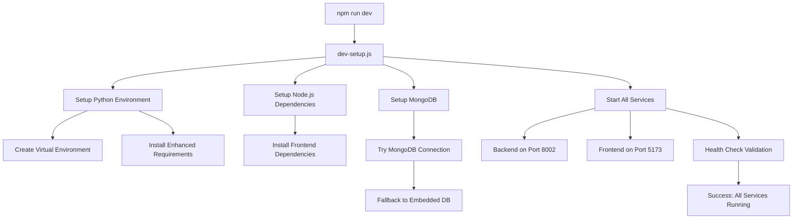

# Implementation Guide
## How to Implement the Streamlined Development Setup

This guide shows you exactly how to implement the development setup plan to eliminate startup friction.

## Quick Implementation Steps

### Step 1: Switch to Code Mode
To implement these files, you'll need to switch to Code mode since Architect mode can only create documentation.

**Recommended approach:**
1. Review this plan and the `DEVELOPMENT_SETUP_PLAN.md`
2. Switch to Code mode to implement the actual files
3. Follow the file creation order below

### Step 2: File Creation Order

Implement files in this specific order for best results:

#### Phase 1: Configuration Files
1. `config/dev-config.json` - Centralized configuration
2. `config/.env.template` - Environment template
3. `backend/requirements-complete.txt` - Enhanced Python requirements

#### Phase 2: Setup Scripts  
4. `scripts/setup-python.bat` - Python environment setup (Windows)
5. `scripts/setup-python.sh` - Python environment setup (Unix/Mac)
6. `scripts/health-check.js` - Service health validation

#### Phase 3: Main Orchestrator
7. `dev-setup.js` - Main setup orchestrator (root level)
8. Update root `package.json` - Add new dev scripts

### Step 3: Testing Process

After implementation, test in this order:

```bash
# 1. First-time setup
npm run dev-setup

# 2. Start everything
npm run dev

# 3. Verify health
npm run health
```

## Key Benefits You'll Get

### ✅ **Eliminates All Your Startup Issues**
- **Missing Dependencies**: Automatically installs python-jose[cryptography], sqlalchemy, etc.
- **Port Conflicts**: Centralized port management prevents mismatches
- **MongoDB Issues**: Automatic fallback to embedded database
- **Environment Variables**: Auto-generates complete .env file

### ✅ **One-Command Experience**
- `npm run dev` - Starts everything
- `npm run health` - Checks if everything is working
- `npm run dev-clean` - Clean restart when needed

### ✅ **Minimal Setup Required**
- Uses your existing Python, Node.js, MongoDB
- No Docker or complex tools needed
- Works with your current Windows environment

### ✅ **Smart Error Handling**
- Clear error messages with solutions
- Automatic recovery from common issues
- Comprehensive troubleshooting guide

## Architecture Overview



## File Structure After Implementation

```
wandering-narwhal-zoom/
├── config/
│   ├── dev-config.json          # ✨ NEW: Centralized config
│   └── .env.template            # ✨ NEW: Complete env template
├── scripts/
│   ├── setup-python.bat        # ✨ NEW: Windows Python setup
│   ├── setup-python.sh         # ✨ NEW: Unix Python setup
│   └── health-check.js         # ✨ NEW: Health validation
├── backend/
│   ├── requirements-complete.txt # ✨ NEW: Enhanced requirements
│   └── [existing files...]
├── frontend/
│   └── [existing files...]
├── dev-setup.js                # ✨ NEW: Main orchestrator
├── package.json                # ✨ UPDATED: New dev scripts
└── DEVELOPMENT_SETUP_PLAN.md   # ✅ DONE: Complete plan
```

## Expected Results

### Before Implementation (Current State)
```bash
# Multiple manual steps required:
cd backend
python -m venv venv
venv\Scripts\activate
pip install python-jose[cryptography]  # Missing!
pip install sqlalchemy                 # Missing!
pip install -r requirements.txt
python main.py                         # Port issues, MongoDB errors

# In another terminal:
cd frontend
npm install
npm run dev                            # Port conflicts

# Manual MongoDB setup, environment variable fixes, etc.
```

### After Implementation (New Experience)
```bash
# Single command does everything:
npm run dev

# Output:
# 🚀 Starting development environment setup...
# 📝 Creating .env file from template...
# 🐍 Setting up Python environment...
# 📦 Setting up Node.js dependencies...
# 🍃 Setting up MongoDB...
# 🚀 Starting all services...
# 🏥 Running health check...
# ✅ FRONTEND: running (port 5173)
# ✅ BACKEND: healthy (port 8002)
# ✅ Database: connected
# 🎉 All services are running successfully!
# 🌐 Frontend: http://localhost:5173
# 🔧 Backend API: http://localhost:8002
```

## Next Steps

1. **Review the complete plan** in `DEVELOPMENT_SETUP_PLAN.md`
2. **Switch to Code mode** to implement the files
3. **Follow the file creation order** above
4. **Test the implementation** with the provided commands
5. **Enjoy friction-free development!**

## Support

If you encounter any issues during implementation:

1. Check the troubleshooting section in `DEVELOPMENT_SETUP_PLAN.md`
2. Run `npm run health` to diagnose problems
3. Use `npm run dev-clean` for a fresh restart

The solution is designed to be self-healing and provide clear guidance when issues occur.