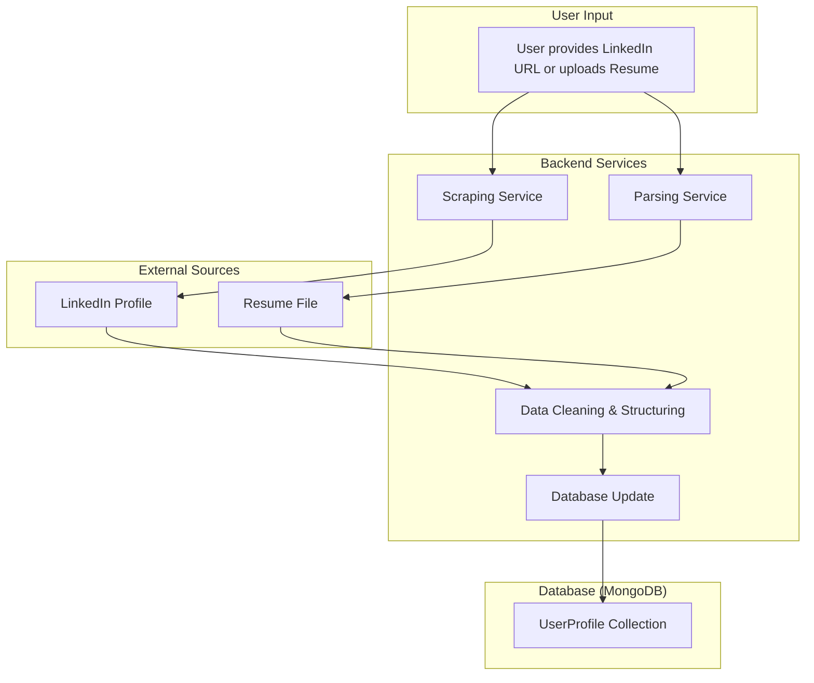

# Technical Architecture & System Design: AI-Powered Recommendation Engine

This document outlines the technical architecture for the AI-Powered Recommendation Engine, based on the product requirements and development plan. It serves as a blueprint for the engineering team.

## 1. High-Level System Architecture

The system is designed as a Modular Monolith, with a clear separation of concerns between the frontend, backend, and external services. This architecture prioritizes simplicity and rapid development for the MVP while allowing for future scalability.

```mermaid
graph TD
    subgraph User
        A[Browser]
    end

    subgraph "Frontend (Next.js)"
        B[Assessment Page]
        C[Results Page with Chat]
        D[Auth Pages]
    end

    subgraph "Backend API (Python/FastAPI)"
        E[API Gateway / Router]
        F[User Module]
        G[Assessment Module]
        H[Recommendation Module]
        I[Data Access Module]
    end

    subgraph "External Services"
        J[AI Model API e.g., Gemini]
        K[Database MongoDB Atlas]
    end

    A --> B
    A --> C
    A --> D

    B --> |Submits Assessment| E
    C --> |Sends Chat Prompts| E
    D --> |Handles Auth| E

    E --> F
    E --> G
    E --> H

    F --> I
    G --> I
    H --> I
    H --> J

    I --> K

    style User fill:#f9f,stroke:#333,stroke-width:2px
    style "Frontend (Next.js)" fill:#ccf,stroke:#333,stroke-width:2px
    style "Backend API (Python/FastAPI)" fill:#cfc,stroke:#333,stroke-width:2px
    style "External Services" fill:#fcf,stroke:#333,stroke-width:2px
```

**Component Descriptions:**

*   **Frontend (Next.js):** A single-page application (SPA) responsible for all user interactions. It communicates with the Backend API via RESTful endpoints.
*   **Backend API (FastAPI):** A modular monolithic application that handles business logic, data processing, and communication with external services.
*   **AI Service (External):** An external AI model (like Google Gemini or OpenAI) accessed via an API. It's responsible for generating and refining career recommendations.
*   **Database (MongoDB Atlas):** A NoSQL database used to store all application data, including user profiles, assessments, and recommendations.
*   **Data Scraping & Parsing Pipeline (Post-MVP):** A future component for automatically ingesting data from LinkedIn and resumes. For the MVP, this is out of scope.

## 2. Data Models

The following Pydantic models define the core data structures for the application, which will be stored in MongoDB.

### UserProfile
```python
from pydantic import BaseModel, EmailStr, Field
from typing import Optional
from datetime import datetime

class UserProfile(BaseModel):
    user_id: str = Field(..., alias="_id")
    email: EmailStr
    hashed_password: str
    created_at: datetime = Field(default_factory=datetime.utcnow)
    # Post-MVP fields for scraped data
    resume_data: Optional[dict] = None
    linkedin_data: Optional[dict] = None
```

### UserAssessment
```python
from pydantic import BaseModel, Field
from typing import List
from datetime import datetime

class UserAssessment(BaseModel):
    assessment_id: str = Field(..., alias="_id")
    user_id: str
    skills: List[str]
    experience: str  # Could be a structured object later
    career_goals: str
    preferences: dict # e.g., {"remote": True, "salary_min": 80000}
    created_at: datetime = Field(default_factory=datetime.utcnow)
```

### JobDescription
This model represents a generic job description that the AI might reference or generate. It is not stored in our database for the MVP but defines the structure of a recommendation.
```python
from pydantic import BaseModel
from typing import List

class JobDescription(BaseModel):
    job_id: str
    title: str
    company: str
    location: str
    description: str
    requirements: List[str]
```

### RecommendationResult
```python
from pydantic import BaseModel, Field
from typing import List
from datetime import datetime

class Recommendation(BaseModel):
    job_title: str
    company: str
    location: str
    summary: str
    match_score: float # A score from 0.0 to 1.0 indicating relevance

class RecommendationResult(BaseModel):
    recommendation_set_id: str = Field(..., alias="_id")
    user_id: str
    assessment_id: str
    recommendations: List[Recommendation]
    created_at: datetime = Field(default_factory=datetime.utcnow)
    conversation_history: List[dict] = [] # Stores user prompts and AI responses
```

## 3. API Specification

The API will be versioned under `/api/v1`.

### Authentication

*   **`POST /api/v1/auth/register`**
    *   **Description:** Registers a new user.
    *   **Request Body:** `{"email": "user@example.com", "password": "strongpassword"}`
    *   **Response (201 Created):** `{"user_id": "...", "email": "user@example.com"}`

*   **`POST /api/v1/auth/login`**
    *   **Description:** Authenticates a user and returns a JWT.
    *   **Request Body:** `{"username": "user@example.com", "password": "strongpassword"}` (form data)
    *   **Response (200 OK):** `{"access_token": "...", "token_type": "bearer"}`

### Recommendations

*   **`POST /api/v1/recommendations`**
    *   **Description:** Takes user assessment data, saves it, and triggers the initial recommendation generation.
    *   **Authentication:** Required (Bearer Token).
    *   **Request Body:** (Matches `UserAssessment` model, without `assessment_id` and `user_id`)
        ```json
        {
          "skills": ["Python", "Data Analysis", "SQL"],
          "experience": "5 years as a data analyst.",
          "career_goals": "Move into a management role.",
          "preferences": {"remote": true}
        }
        ```
    *   **Response (201 Created):** (Matches `RecommendationResult` model)
        ```json
        {
          "recommendation_set_id": "...",
          "user_id": "...",
          "assessment_id": "...",
          "recommendations": [...],
          "created_at": "...",
          "conversation_history": []
        }
        ```

*   **`POST /api/v1/recommendations/{recommendation_set_id}/tune`**
    *   **Description:** Refines an existing recommendation set based on a user's chat prompt.
    *   **Authentication:** Required (Bearer Token).
    *   **Request Body:**
        ```json
        {
          "prompt": "Show me more jobs with a better work-life balance."
        }
        ```
    *   **Response (200 OK):** (Returns the updated `RecommendationResult` object)
        ```json
        {
          "recommendation_set_id": "...",
          "user_id": "...",
          "assessment_id": "...",
          "recommendations": [...], // Updated recommendations
          "created_at": "...",
          "conversation_history": [
            {"role": "user", "content": "Initial prompt..."},
            {"role": "assistant", "content": "First set of results..."},
            {"role": "user", "content": "Show me more jobs with a better work-life balance."}
          ]
        }
        ```

## 4. AI Model Integration Plan

*   **Integration Method:** The AI model will be integrated as a microservice, accessed via a REST API. The backend will have a dedicated `AIModule` that encapsulates all logic for communicating with this external service. This decouples our application from the specific AI provider and simplifies maintenance.

*   **Data Contract:** The `AIModule` will be responsible for translating our internal data models into the format expected by the AI service and parsing its response back into our application's models.

    *   **Request to AI Service (Initial Recommendation):**
        ```json
        {
          "user_profile": {
            "skills": ["Python", "Data Analysis", "SQL"],
            "experience": "5 years as a data analyst.",
            "career_goals": "Move into a management role.",
            "preferences": {"remote": true}
          },
          "task": "generate_career_recommendations"
        }
        ```

    *   **Request to AI Service (Tuning):**
        ```json
        {
          "conversation_history": [
            {"role": "user", "content": "Initial prompt..."},
            {"role": "assistant", "content": "First set of results..."}
          ],
          "new_prompt": "Show me more jobs with a better work-life balance.",
          "task": "refine_career_recommendations"
        }
        ```

    *   **Expected Response from AI Service:** A JSON object containing a list of recommendations that can be parsed into our `Recommendation` model.
        ```json
        {
          "recommendations": [
            {
              "job_title": "Senior Data Analyst",
              "company": "Tech Corp",
              "location": "Remote",
              "summary": "An excellent role for an experienced data analyst looking for growth.",
              "match_score": 0.95
            }
          ]
        }
        ```

## 5. Data Scraping & Parsing Pipeline (Post-MVP)

While deferred for the MVP, the architecture for this pipeline is designed as follows.



**Pipeline Steps:**

1.  **Initiation:** The user provides their LinkedIn profile URL or uploads a resume file.
2.  **Scraping/Parsing:**
    *   A dedicated **Scraping Service** (e.g., using libraries like BeautifulSoup or a headless browser) fetches the raw HTML from the LinkedIn profile.
    *   A **Parsing Service** (e.g., using libraries like `python-docx` or `pypdf`) extracts raw text from the resume file.
3.  **Data Cleaning & Structuring:** The raw text from both sources is passed to a cleaning module. This module uses a combination of regex, NLP, and potentially another AI model call to extract and structure key information (e.g., work experience, skills, education) into a consistent JSON format.
4.  **Storage:** The structured JSON data is stored in the `resume_data` or `linkedin_data` fields within the user's `UserProfile` document in MongoDB. This data can then be used to pre-fill or enhance their `UserAssessment`.

## 6. Data Collection and Knowledge Base Strategy

To ensure high-quality recommendations, the system relies on two key data components: the data collected from the user and the job knowledge base available to the AI.

### 6.1. User Assessment - Data Collection Strategy

The goal of the user assessment is to gather a rich, multi-faceted understanding of the user's professional profile and aspirations. For the MVP, this will be a structured form with the following sections:

*   **Core Experience:**
    *   **Years of Experience:** A numerical input (e.g., 0, 1-3, 3-5, 5-10, 10+).
    *   **Current/Recent Job Title:** Free text.
    *   **Industry:** A dropdown with an option for "Other" (e.g., Technology, Healthcare, Finance).
*   **Skills:**
    *   **Technical Skills:** A tag-based input for hard skills (e.g., Python, SQL, Project Management).
    *   **Soft Skills:** A checklist of key soft skills (e.g., Communication, Teamwork, Problem-Solving).
*   **Career Goals & Preferences:**
    *   **Desired Salary Range:** A slider or numerical input.
    *   **Work Environment:** Checkboxes for preferences (e.g., Remote, Hybrid, On-site).
    *   **Company Size:** Checkboxes for preferences (e.g., Startup, Mid-Size, Large Corporation).
    *   **Career Aspirations:** A text area for the user to describe their goals in their own words (e.g., "I want to transition from a technical role to a leadership position," "I'm looking for better work-life balance").

This structured approach provides the AI with clear, quantifiable data while the free-text fields allow for nuance.

### 6.2. Job Knowledge Base Strategy

The recommendation engine's effectiveness depends on the AI model's access to a comprehensive and up-to-date understanding of the job market. We will not be building and maintaining a job database ourselves for the MVP. Instead, we will leverage a large language model (LLM) that has been pre-trained on a vast corpus of public data from the internet, which includes a wide spectrum of job descriptions, career paths, and industry trends.

*   **How it Works:**
    1.  **Pre-trained Knowledge:** The LLM already has a deep, implicit knowledge of countless job titles, from entry-level to senior executive, across all major industries. It understands the typical skills, responsibilities, and qualifications for these roles.
    2.  **Dynamic Generation:** When a user submits their assessment, we are not querying a static database of jobs. Instead, we are sending the user's profile to the LLM and asking it to *generate* a list of suitable career recommendations based on its vast internal knowledge.
    3.  **Comprehensive Coverage:** This approach ensures we can cover the full spectrum of jobs without the massive overhead of scraping and maintaining our own database. The LLM can reason about and suggest niche roles or new, emerging job titles that a static database might miss.
    4.  **Refinement:** The interactive chat allows the user to further guide the AI, helping it to narrow down its vast knowledge base to the specific roles that best match the user's refined criteria.

By relying on the LLM's pre-existing knowledge, we can provide comprehensive, relevant, and up-to-date recommendations for all experience levels without needing to build a job scraping pipeline for the MVP.