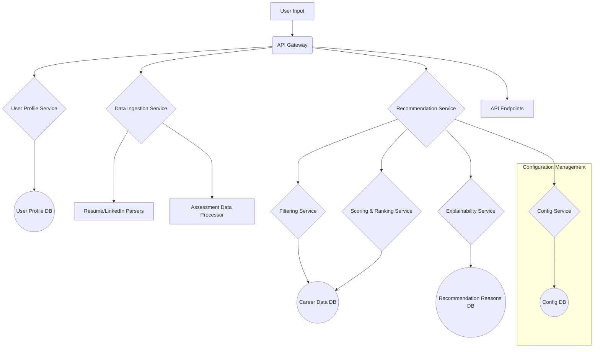

# Career Recommendation Engine: Technical Architecture

## 1. Data Modeling

### 1.1 User Profile

The `UserProfile` will be a comprehensive document that aggregates data from multiple sources to create a holistic view of the user.

```json
{
  "userId": "unique_user_id",
  "personalInfo": {
    "age": 30,
    "location": "San Francisco, CA",
    "salaryExpectations": {
      "min": 80000,
      "max": 120000,
      "currency": "USD"
    }
  },
  "assessmentResults": {
    "personalityTraits": ["Introverted", "Analytical", "Detail-Oriented"],
    "workValues": ["Autonomy", "Innovation", "Work-Life Balance"],
    "interests": ["Technology", "Data Analysis", "Problem Solving"]
  },
  "professionalData": {
    "resume": {
      "parsed": true,
      "url": "s3://bucket/path/to/resume.pdf",
      "skills": ["Python", "SQL", "Machine Learning", "Project Management"],
      "experience": [
        {
          "title": "Data Analyst",
          "company": "Tech Corp",
          "duration": "2 years"
        }
      ]
    },
    "linkedinProfile": {
      "url": "https://linkedin.com/in/username",
      "skills": ["Data Visualization", "Statistical Analysis"],
      "connections": 500
    }
  },
  "userInterests": ["AI Ethics", "Sustainable Technology"]
}
```

### 1.2 Career Path

The `CareerPath` model will define the attributes of each career, including required skills, qualifications, and potential salary ranges.

```json
{
  "careerId": "unique_career_id",
  "title": "Machine Learning Engineer",
  "description": "Designs and develops machine learning and deep learning systems.",
  "requiredSkills": [
    { "skillId": "skill_1", "name": "Python", "proficiency": "Advanced" },
    { "skillId": "skill_2", "name": "TensorFlow", "proficiency": "Intermediate" },
    { "skillId": "skill_3", "name": "Scikit-learn", "proficiency": "Intermediate" }
  ],
  "salaryRange": {
    "min": 100000,
    "max": 160000,
    "currency": "USD"
  },
  "demand": "High",
  "relatedCareers": ["career_id_2", "career_id_3"]
}
```

### 1.3 Skill

The `Skill` model will be a centralized repository of all skills, allowing for easy management and mapping.

```json
{
  "skillId": "unique_skill_id",
  "name": "Python",
  "category": "Programming Language",
  "relatedSkills": ["skill_id_4", "skill_id_5"]
}
```

## 2. System Architecture

A **microservices architecture** is recommended to ensure scalability, maintainability, and flexibility.



### Data Flow

1.  **User Input:** The user provides data through the application (resume, LinkedIn, assessments).
2.  **API Gateway:** All incoming requests are routed through the API Gateway.
3.  **Data Ingestion Service:** This service handles the intake and initial processing of user data.
4.  **User Profile Service:** Creates and manages user profiles, storing them in the User Profile Database.
5.  **Recommendation Service:** Orchestrates the recommendation process.
6.  **Filtering Service:** Applies initial filters to narrow down the list of potential careers.
7.  **Scoring & Ranking Service:** Scores and ranks the filtered careers based on the user's profile.
8.  **Explainability Service:** Generates and stores the reasoning behind each recommendation.
9.  **API Endpoints:** The final recommendations are exposed through API endpoints.

## 3. Recommendation Workflow

### 3.1 Data Ingestion and User Profile Creation

- **Input:** Raw user data (resume, LinkedIn URL, assessment answers).
- **Process:**
    1.  The `Data Ingestion Service` receives the data.
    2.  It uses specialized parsers to extract structured information (skills, experience).
    3.  The `User Profile Service` creates or updates the user's profile with this new data.

### 3.2 Multi-Stage Filtering

1.  **Initial Filtering:** Based on high-level user preferences like salary expectations and location.
2.  **Skill-Based Filtering:** Matches the user's skills with the required skills for each career.
3.  **Interest-Based Filtering:** Considers the user's stated interests and personality traits.

### 3.3 Scoring and Ranking Algorithm

- **Input:** A filtered list of potential careers.
- **Process:**
    1.  A weighted scoring algorithm calculates a match score for each career.
    2.  Weights are configurable and can be adjusted based on the importance of different factors (e.g., skills match vs. interest match).
    3.  The careers are ranked based on their final scores.

### 3.4 Categorization

- **Safe Zone:** Careers that are a strong match with the user's current skills and experience.
- **Stretch Zone:** Careers that are a good match but may require some skill development.
- **Adventure Zone:** Careers that align with the user's interests but would require significant upskilling.

## 4. Explainability

The `Explainability Service` will store the reasons for each recommendation in a dedicated database.

```json
{
  "recommendationId": "unique_rec_id",
  "userId": "user_id",
  "careerId": "career_id",
  "reasons": [
    {
      "type": "skill_match",
      "description": "Strong match for skills: Python, Machine Learning.",
      "score_impact": 0.4
    },
    {
      "type": "interest_match",
      "description": "Aligned with your interest in AI Ethics.",
      "score_impact": 0.2
    }
  ]
}
```

This data will be surfaced to the user to provide transparency and build trust.

## 5. Configuration and Versioning

A dedicated `Config Service` will manage the rules, weights, and parameters of the recommendation algorithm.

- **Storage:** Configuration will be stored in a version-controlled database (e.g., using a Git-based workflow or a dedicated config database).
- **Versioning:** Each change to the configuration will create a new version. This allows for easy rollbacks and A/B testing of different algorithm parameters.
- **API:** The `Config Service` will expose an API for the `Recommendation Service` to fetch the current configuration.
```
