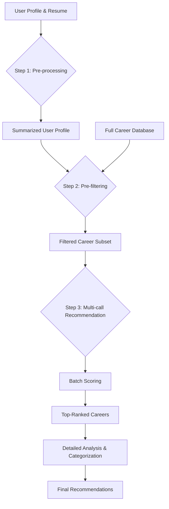

# Recommendation Engine Multi-Step Architecture

## 1. Overview

To address the "prompt is too long" error, this new architecture redesigns the recommendation process into a multi-step pipeline. The core principle is to reduce the volume of data sent to the language model in a single request by introducing pre-processing and pre-filtering steps, and by structuring the final recommendation generation into a multi-call process.

This approach ensures that each call to the language model is lightweight and focused, preventing prompt size errors and improving the scalability and reliability of the recommendation engine.

## 2. Architectural Diagram (Mermaid)

## 3. Multi-Step Process

### Step 1: User Profile & Resume Pre-processing

*   **Objective**: To condense the user's profile and resume into a concise summary, reducing the amount of text sent in subsequent steps.
*   **Process**:
    1.  **Input**: Full `UserProfile` object, including the raw `resumeText`.
    2.  **Action**: Make a dedicated call to the language model with a prompt specifically designed for summarization. This prompt will instruct the model to extract and synthesize the most critical information, such as:
        *   Key skills and areas of expertise.
        *   Years of experience and career progression.
        *   Primary industries and domains.
        *   Stated career goals and interests.
    3.  **Output**: A summarized user profile (e.g., a JSON object with structured fields or a concise text summary).

### Step 2: Career Pre-filtering

*   **Objective**: To select a smaller, more relevant subset of careers from the main database *before* engaging the language model for scoring.
*   **Process**:
    1.  **Input**: The summarized user profile from Step 1 and the full list of `available_careers`.
    2.  **Action**: Implement a lightweight, non-LLM filtering mechanism. This could involve a combination of:
        *   **Keyword Matching**: Matching keywords from the summarized profile (e.g., "software engineering," "product management") with career titles and descriptions.
        *   **Skill Overlap**: Calculating the overlap between the user's skills and the required skills for each career.
        *   **Industry Filtering**: Filtering careers based on the user's preferred industries.
    3.  **Output**: A reduced list of candidate careers (e.g., 100-200) that are most likely to be a good fit for the user.

### Step 3: Structured, Multi-call Recommendation Generation

*   **Objective**: To avoid a single, oversized prompt by breaking the final recommendation and scoring process into multiple, smaller calls.
*   **Process**:
    1.  **Batch Scoring**:
        *   **Input**: The summarized user profile and the filtered list of candidate careers.
        *   **Action**: Instead of sending all candidate careers at once, send them in smaller batches (e.g., 20-30 careers per call). For each batch, the language model will score the careers based on their relevance to the user's summarized profile.
        *   **Output**: A list of scored careers from all batches.
    2.  **Top Candidate Analysis & Categorization**:
        *   **Input**: The top N (e.g., 20-30) highest-scoring careers from the batch scoring phase.
        *   **Action**: Make a final, more detailed call to the language model with these top candidates. In this call, the model will:
            *   Provide a detailed explanation for why each career is a good match.
            *   Categorize each career into the "Safe," "Stretch," and "Adventure" zones.
            *   Generate the final, user-facing recommendations.
        *   **Output**: The final list of `CareerRecommendation` objects.

## 4. Changes to `recommendation-engine/engine.py`

To implement this new architecture, the following changes will be required in the `RecommendationEngine` class:

*   **New Methods**:
    *   `_preprocess_user_profile(user_profile: UserProfile) -> SummarizedProfile`: A new private method to handle the pre-processing step.
    *   `_prefilter_careers(summarized_profile: SummarizedProfile, available_careers: List[Career]) -> List[Career]`: A new private method for the pre-filtering logic.
*   **Modified `get_recommendations` Method**:
    *   The `get_recommendations` method will be updated to orchestrate the new multi-step process:
        1.  Call `_preprocess_user_profile`.
        2.  Call `_prefilter_careers`.
        3.  Implement the batch scoring and top candidate analysis logic.
*   **Configuration Updates**:
    *   The `RecommendationConfig` will need to be updated with new parameters to control the multi-step process, such as `batch_size` for scoring and `top_n_candidates` for the final analysis.
